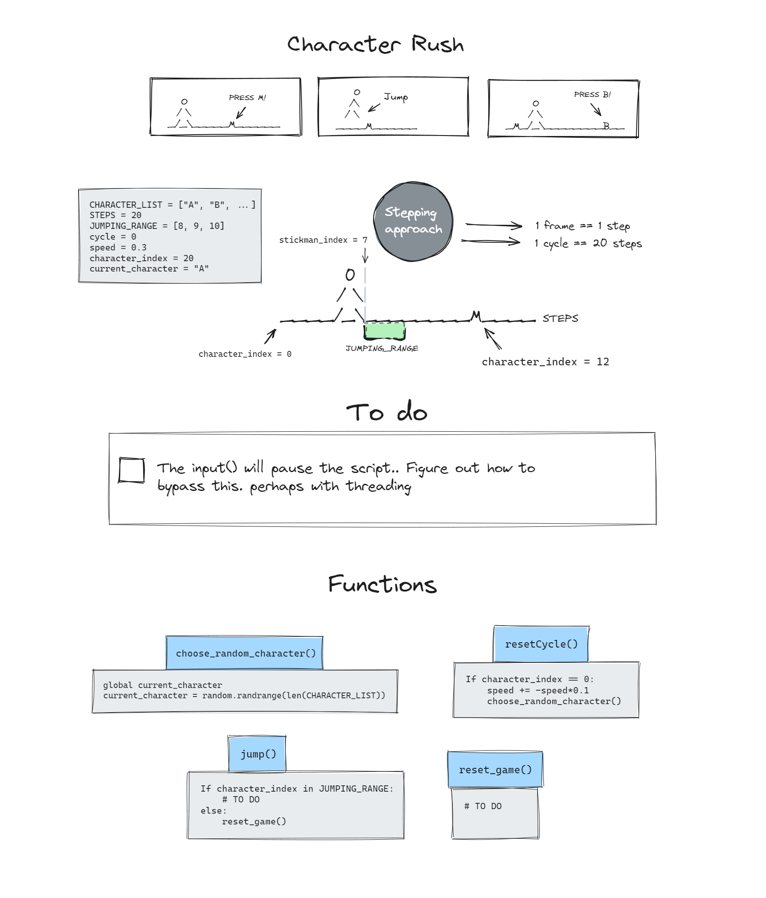
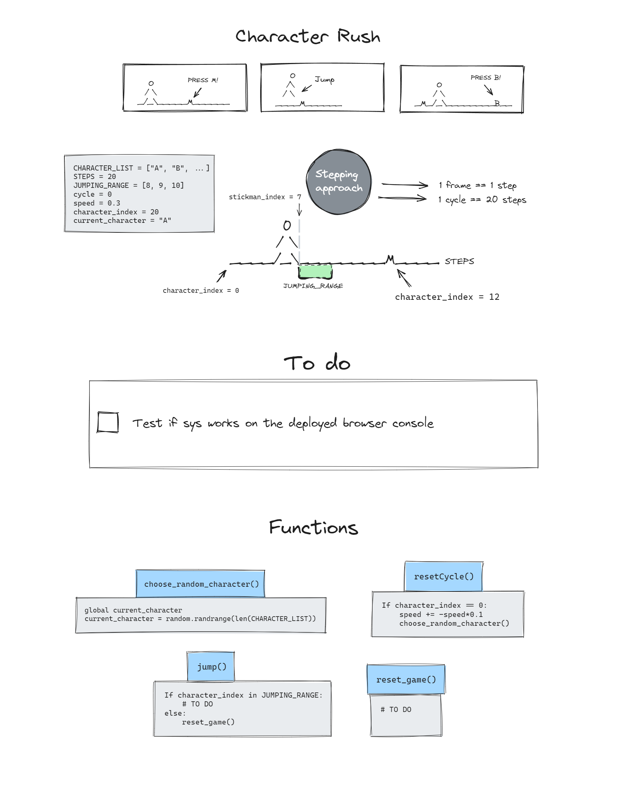

<link rel="stylesheet" type="text/css" media="all" href="assets/css/readme.css" />

# Character rush

## Styling tip!

This document has more 
intricate styling 
when viewed in a previewer such as eg. VS Code. 

## Introduction

This is a Python-based dexterity game for practicing keyboard typing.

## Development process

In this section I will document the development process as it progresses.

Here's the 'sketchy' diagrams to envision the foreseen process of this project. The initial sketch is on the **left** and the current 'live' document is on the **right**   

|  |  |
|--------------------------------------------|--------------------------------------------|

## Code

##### Template
- To get the Python console into the browser I used template files provided by Code Institute 
[Source](https://github.com/Code-Institute-Solutions/love-sandwiches-p5-sourcecode/tree/master/05-deployment/01-deployment-part-1)

##### Third-party libraries (listed in the package.json file) 

- xterm 

A library that helps with integrating the terminal into the browser

## Third-parties

##### [Excalidraw](https://excalidraw.com/)

Excalidraw is an online drawing tool that I used for drawing the development diagram.

## Credits

For manipulating the terminal (moving the cursor, changing colors, etc.) I've been using this cheatsheet by [ConnerWill](https://gist.github.com/ConnerWill) on GitHub
[Source](https://gist.github.com/ConnerWill/d4b6c776b509add763e17f9f113fd25b)

