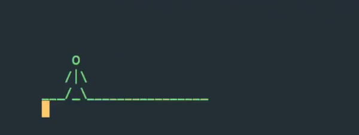
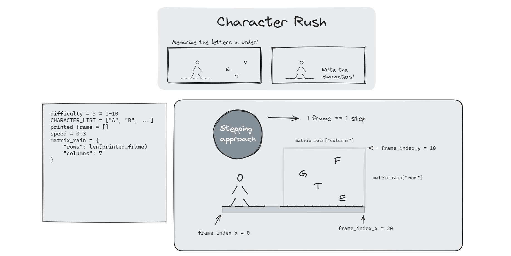
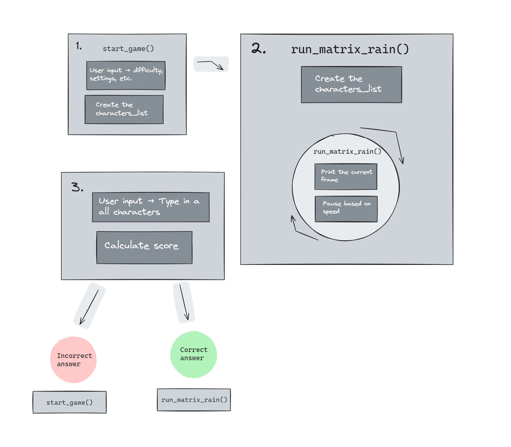

<link rel="stylesheet" type="text/css" media="all" href="assets/css/readme.css" />

# Character rush

## Styling tip!

This document has more intricate
 styling 
when viewed in a previewer such as eg. VS Code. 

## Introduction

This is a Python-based in-terminal game designed to enhance one's memory. Having a sharp memory can be beneficial in many ways. Have you ever dreamed of being able to count cards? In a deck, there are 
52
cards, and if you can remember all of them, you will undoubtedly be better off. This game is all about memorizing characters, and if you manage to surpass 52 characters, arguably, you might have a chance at 
counting cards!
 Now that this game has been introduced powerfully, let's break down the intended audience and some less supernatural examples. 

Since this game exists inside the Python terminal, it is supposed to be used by developers. The matrix is an icon for coding, and this project is heavily inspired by it. Having a sharp short-term memory as a developer can be crucial for many reasons. For example, when writing a function, you may need to keep track of multiple variables simultaneously. If you manage to do so, you won't need to repeatedly check variables (their state, their type, what they do, etc.), allowing you to work more efficiently.

Click 
[here](https://character-rush-05511809a26b.herokuapp.com/)
to navigate to the deployed app.

## Instructions

The goal is to memorize as many characters as you possibly can. Before starting a game, you'll be able to configure settings such as difficulty and speed. When the game starts, try to remember all the characters in order. The number of characters will increase for each round, but to get to the next round you need to submit the correct answer. In the first round, you'll have to memorize 5 characters.

## Development process

When I started working on this project, I wanted to create a game inside the Python terminal that could respond to user inputs in real time. I was able to bring this vision to life, but unfortunately, I couldn't replicate the user experience in the deployed 'browser terminal'. I entertained the thought of rebuilding the 'browser terminal' myself, but after some consideration, I decided to avoid getting sidetracked on this project. Therefore, the development process consists of two parts. 

1. Developing a starting point for the first project idea.
2. Developing the current version of the project.

Luckily, I was able to reuse some previously written code and I didn't find it to be that decremental. I've also documented the first project further down in this document.

##### Project diagrams
The first step was to prepare myself with project diagrams. The process of crafting a 'map' to visually and logically prepare myself was very helpful. Even though I didn't end up following it perfectly, it worked as a guiding hand. It helped me to stay on track with my project goals. Sometimes, I feel that it can be alluring to prioritize features that may only 'enhance' the project rather than finishing it. In these moments, I used the project diagrams to steer me in the right direction. 

The diagrams below are the initial diagrams, but with edited colors to better fit in this document. 

## Future implementations

    

        Make it more child-friendly
    

Right now, this system doesn't support fewer characters than the number of rows. Which could create an overwhelming first impression of the game. The easiest mode should start with a single character to remember, this would allow a wider audience to participate.

    

        More customization
    

The user should be able to choose how many characters they want to memorize. 

    

        Remember settings
    

If the user loses a round, ask them if they want to keep the settings instead of having to go through the game setup once again. This would improve the user experience.

    

        Health
    

Implement a health system to give the player an extra chance. If the player loses a round, instead of having to start over, they should be given an extra chance to memorize the characters. The amount of 'health units' should be a global variable that is carried over across rounds.  

    

        More
    

- Scoreboard

## First version

Now, let's explore the 
first version 
of this project
!
If you'd like to try it out in a normal Python terminal, feel free to download the Python file and run it locally in a terminal of your choice. Click 
[HERE](https://github.com/KevinBjarnemark/character-rush/blob/main/first_version.py)
to navigate to the source code. 

#### Rules/instructions

The goal is to leap over the moving characters.

1. Read the moving character.
2. Type it in on your keyboard.
3. Press enter to jump.

The stickman will jump only when the correct character is submitted. 

#### Disclaimer!

This 'first version' game shouldn't be viewed as a finished product, but rather a 'starting point' for a larger project. Many features have not been implemented and the code does not follow best practices in terms of performance, optimization, refactoring, etc.

#### Project Incentive

Being able to type efficiently on a keyboard is almost mandatory in today's age. Likely, the user who plays this game will soon realize that a higher score can be reached by avoiding looking at the keyboard. Thus, they will unwittingly develop the skill of typing more efficiently and naturally while having fun at the same time.

A more comprehensive and long-term goal would be to target not only people who want to learn how to type on a keyboard but also professionals who seek to sharpen their skills. Perhaps a game like this could be published as a library for developers who want to be stimulated while waiting for a command to finish. This may be a long shot, but imagine running 'npm install' and, while the packages install, the developer can practice their typing skills with the packages installing in the background, without leaving the terminal.

#### Development

##### Initial sketch

Most of the implemented concepts have already been explained in this document. One distinction though, is that the user input runs on its own thread. This is to prevent the terminal from pausing the script when the user has to submit a character in order to jump.

#### Features to be implemented

If you want to further develop this project, here are some suggestions of what you might want to implement.

    

        Speed control
    

The user should be able to dial in the speed of the moving characters

    

        Gameplay
    

Right now, if the user jumps too late, the characters will run through the legs, causing a glitchy effect. There's no real need to fix this if a game reset occurs at that point. However, it may be wise to fix this if, for example, a 'practice mode' gets implemented. Perhaps creatively, by making the stickman fall or something similar.

    

        Game modes
    

- Increase the speed for every successful jump.
- Adjust difficulty

    

        More
    

- Scoring system and scoreboard.
- Let the user input custom characters/symbols
- Add a skateboard

## Code

In-code readme references are declared as "README #id" througout the source code. 

### #1
##### How frames are printed

The game is based on the concept of FPS (frames per second). The speed variable controls the rate at which the frames are printed. To print the frames, I decided to use the built-in Python package 'sys'. This package enables control over the cursor, allowing drawing in the terminal without printing new lines. It's similar to drawing an image, clearing the canvas, and quickly redrawing a new image. To demonstrate this, watch the flashing cursor in action in any of the gameplay videos above. This approach allows us to first, draw the frames conditionally, and then render those frames on a line-by-line basis.

### #2
##### How y is calculated

This algorithm builds the 'current frame' by 'surgically' inserting the character at hand at the correct position, meaning the column (x) and row (y). It 'paints' the initial scene and redraws only the changing elements. Since the number of characters can vary, it reads them top-down, then it inserts them in a falling matter, and lastly, it removes the top-most character as soon as a character moves out of bounds. In this way, it'll be the same 'rap' in the next iteration.

1. Read the characters top-down
2. Insert character (i) in the correct row (y)
3. Delete the top-most character (when it is out of bounds)

The characters get inserted by first, measuring the distance to the ground (rows) and then, subtracting the full distance from the character index (i). In practice, if the distance (rows) is equal to 5, it subtracts 5 by the character index eg. 5, giving us 0. This makes sense because the fifth character should be placed at the top since it is the last falling character. Remember that the length of the loop is restricted so that it won't keep calculating into 'uncharted territory'. 

It gets a bit more complicated in the first couple of frames. If the first character that enters the frame gets subtracted by the number of rows, it ends up at the bottom. Therefore, before the first characters have reached the ground, they all have to be pushed incrementally. Instead of creating and managing a new variable to handle increments, this system uses the already managed 'frame_count' variable. 

If the frame_count is less than the number of rows, meaning, if the characters haven't reached the ground yet, the algorithm subtracts the character index by the frame_count instead of the rows, so that y = **(frame_count - 1 - i)**. if frame_count = 1, and i = 0, y will be **(1 - 1 - 0)** placing it at the top. The next frame y will be **(2 - 1 - 0)**, placing it on the second row. In other words, the frame_count will push the characters down with each frame. As soon as the frame_count surpass the number of rows, we don't need to push the characters anymore.

By the time a character moves out of bounds, the top-most character in the list will be removed, ensuring the rain effect continues seamlessly.

## Credits

#### Template
To get the Python console into the browser I used template files provided by Code Institute 
[Source](https://github.com/Code-Institute-Solutions/love-sandwiches-p5-sourcecode/tree/master/05-deployment/01-deployment-part-1)

### Fonts

The fonts listed below are used in this project and all of them are [Google fonts](https://fonts.google.com/).

- [Tilt Neon](https://fonts.google.com/specimen/Tilt+Neon)
- [Luckiest Guy](https://fonts.google.com/specimen/Luckiest+Guy)

### External sources

For manipulating the terminal (moving the cursor, changing colors, etc.) I've been using this cheatsheet by [ConnerWill](https://gist.github.com/ConnerWill) on GitHub
[Source](https://gist.github.com/ConnerWill/d4b6c776b509add763e17f9f113fd25b)

## Third-parties

##### [Third party libraries](https://github.com/KevinBjarnemark/character-rush/blob/main/package.json)
These packages are listed in the package.json file and requirements.txt

##### [Excalidraw](https://excalidraw.com/)

Excalidraw is an online drawing tool that I used for drawing the development diagram.
