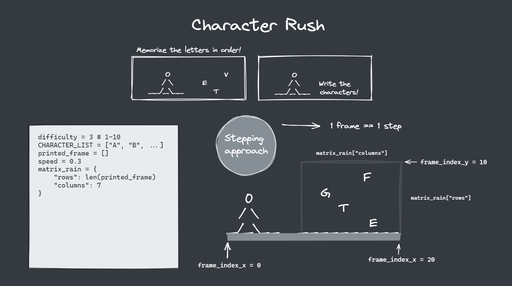
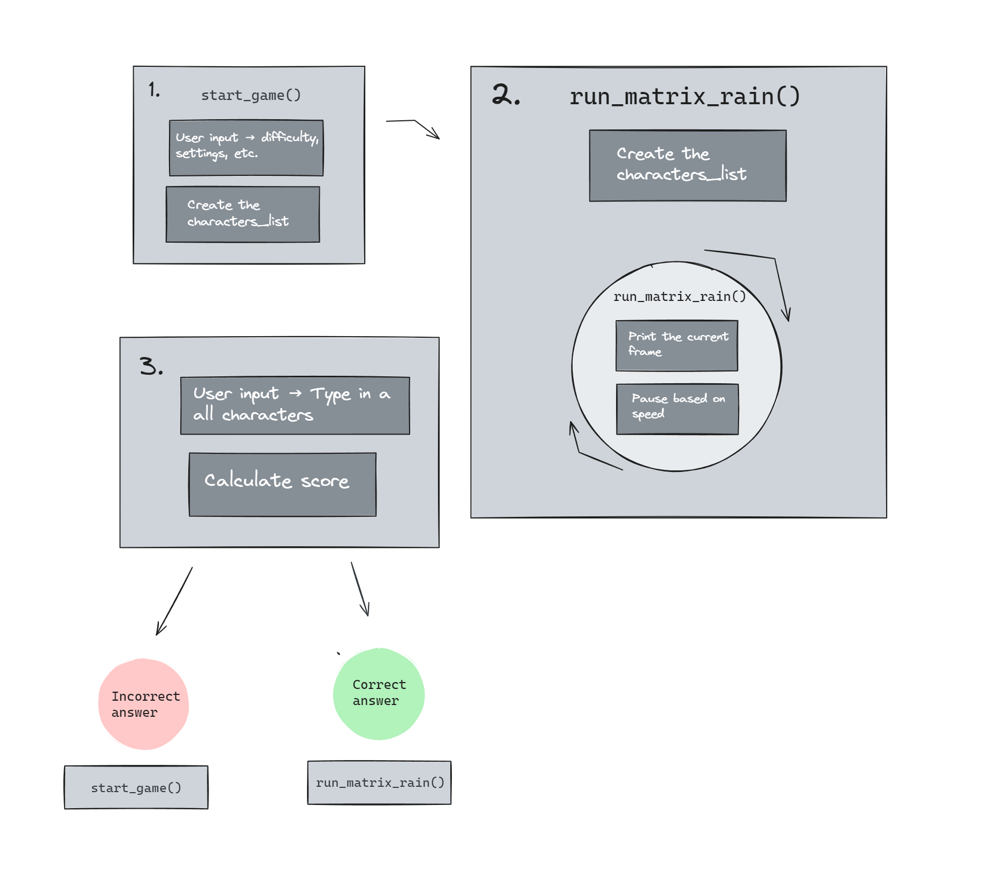
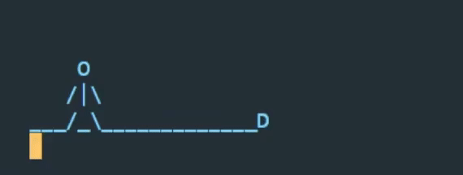
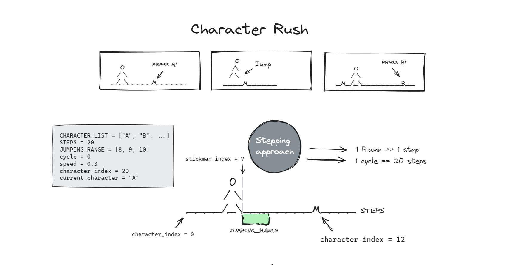

<link rel="stylesheet" type="text/css" media="all" href="assets/css/readme.css" />

# Character rush

## Styling tip!

This document has more intricate
 styling 
when viewed in a previewer such as eg. VS Code. 

## Introduction

This is a Python-based memory game with matrix vibes. 

Click 
[here](https://character-rush-05511809a26b.herokuapp.com/)
to navigate to the deployed app

## Development process

When I started working on this project, I wanted to craft a game inside the Python terminal that could respond to user inputs in real time. I was able to match this vision, but unfortunately, I couldn't replicate the user experience in the deployed 'browser terminal'. I entertained the thought of rebuilding the 'browser terminal' myself, but after some consideration, I decided to avoid getting sidetracked on this project. Therefore, the development process consists of two parts. 

1. Developing a starting point for the first project idea.
2. Developing the current version of the project.

Luckily, I was able to reuse some previously written code and I didn't find it to be that decremental. I've also documented the first project further down in this document.

##### Project diagrams
For this project I prepared myself with project diagrams. The process of crafting a 'map' to visually and logically prepare myself was very helpful. Even though I didn't end up following perfectly, it worked as a guiding hand. It helped me to stay on track with my project goals. Sometimes, I feel that it can be alluring to prioritize features that may only 'enhance' the project rather than finishing it. In these moments, I used the project diagrams to steer me in the right direction. 

 |

 |

### First version
Initially, my goal was to explore the limits of what could be achieved within the Python terminal by designing a game that could handle user inputs in real-time. I was able to match this vision, but unfortunately, I couldn't replicate the user experience in the deployed 'browser terminal'. I entertained the thought of rebuilding the 'browser terminal' myself, but after some consideration, I decided to avoid getting sidetracked on this project. If you'd like to try it out in a normal Python terminal, you can download the Python file and run it locally in a terminal of your choice.

#### Rules/instructions

The goal is to leap over the moving characters.

1. Read the moving character.
2. Type it in on your keyboard.
3. Press enter to jump.

The stickman will jump only when the correct character is submitted. 

Click 
[HERE](https://github.com/KevinBjarnemark/character-rush/blob/main/first_version.py)
to navigate to the source code. 

#### Disclaimer!

This game shouldn't be viewed as a finished product, but rather a 'starting point' for a larger project. Many features have not been implemented and the code does not follow best practices in terms of performance, optimization, refactoring, etc.

#### Introduction

Being able to type efficiently on a keyboard is almost mandatory in today's age. Likely, the user who plays this game will soon realize that a higher score can be reached by avoiding looking at the keyboard. Thus, they will unwittingly develop the skill of typing more efficiently and naturally while having fun at the same time.

A more comprehensive and long-term goal would be to target not only people who want to learn how to type on a keyboard but also professionals who seek to sharpen their skills. Perhaps a game like this could be published as a library for developers who want to be stimulated while waiting for a command to finish. This may be a long shot, but imagine running 'npm install' and, while the packages install, the developer can practice their typing skills with the packages installing in the background, without leaving the terminal.

#### Code

##### Initial sketch

The game is based on the concept of FPS (frames per second). The speed variable controls the rate at which the frames are printed and is set to 0.1 by default.

The user input runs on its own thread to prevent the terminal from pausing the script.

##### How frames are printed

To print the frames, I decided to use the built-in Python package 'sys'. This package enables control over the cursor, allowing drawing in the terminal without printing new lines. It's similar to drawing an image, clearing the canvas, and quickly redrawing a new image. To demonstrate this, watch the flashing cursor in action in the gameplay video above (gif).

This approach allows us to first, draw the frames conditionally, and then render those frames on a line-by-line basis. Since this is a pre-mature project, it has many problems that need to be resolved and new lines will be created when the user submits an input.

#### Features to be implemented

If you want to further develop this project, here are some suggestions of what you might want to implement.

    

        Speed control
    

The user should be able to dial in the speed of the moving characters

    

        Gameplay
    

Right now, if the user jumps too late, the characters will run through the legs, causing a glitchy effect. There's no real need to fix this if a game reset occurs at that point. However, it may be wise to fix this if, for example, a 'practice mode' gets implemented. Perhaps creatively, by making the stickman fall or something similar.

    

        Game modes
    

- Increase the speed for every successful jump.
- Adjust difficulty

    

        More
    

- Scoring system and scoreboard.
- Let the user input custom characters/symbols
- Add a skateboard

## Code

##### Template
- To get the Python console into the browser I used template files provided by Code Institute 
[Source](https://github.com/Code-Institute-Solutions/love-sandwiches-p5-sourcecode/tree/master/05-deployment/01-deployment-part-1)

## Third-parties

##### [Third party libraries](https://github.com/KevinBjarnemark/character-rush/blob/main/package.json)
These packages are listed in the package.json file

##### [Excalidraw](https://excalidraw.com/)

Excalidraw is an online drawing tool that I used for drawing the development diagram.

## Credits

For manipulating the terminal (moving the cursor, changing colors, etc.) I've been using this cheatsheet by [ConnerWill](https://gist.github.com/ConnerWill) on GitHub
[Source](https://gist.github.com/ConnerWill/d4b6c776b509add763e17f9f113fd25b)
